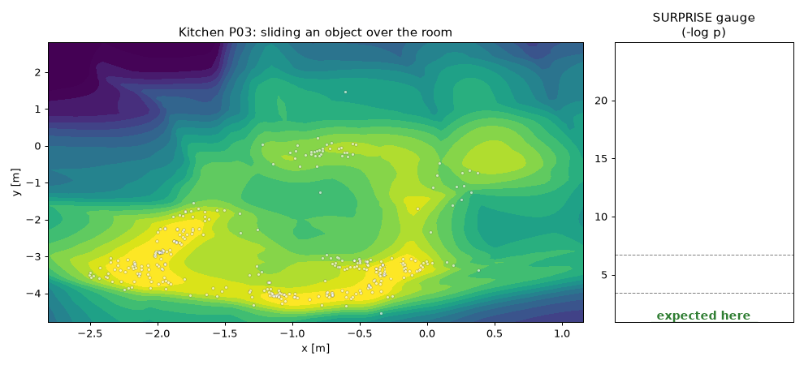
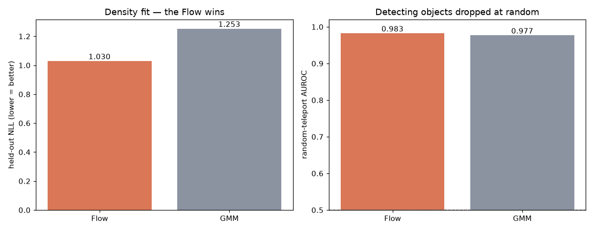
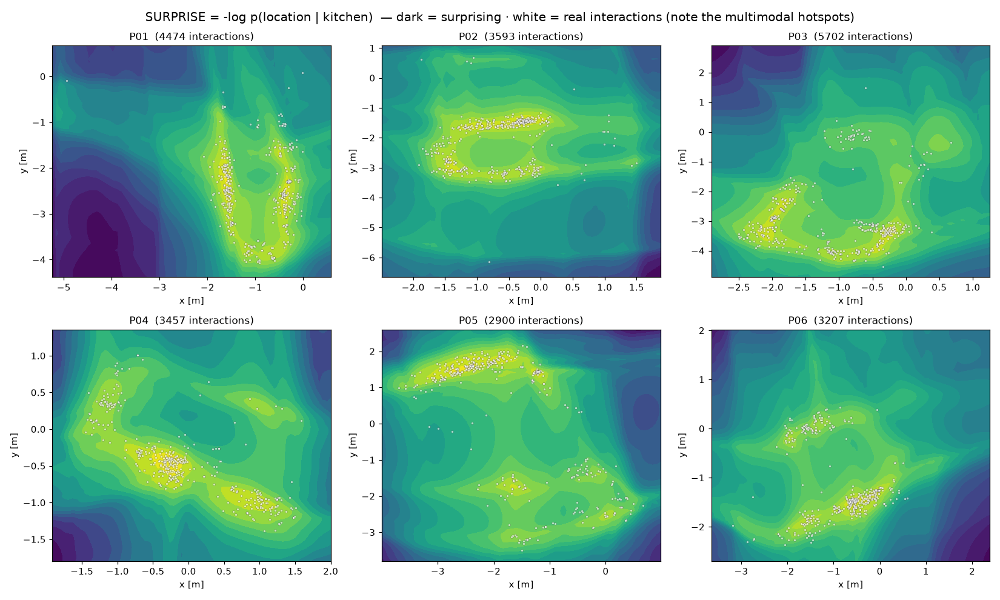
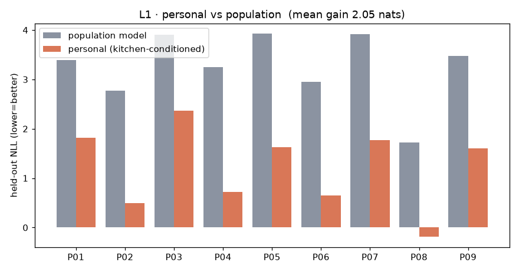
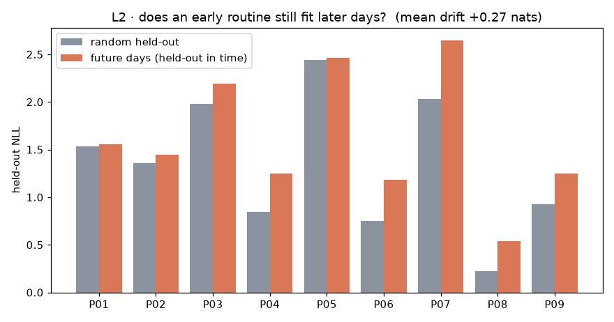
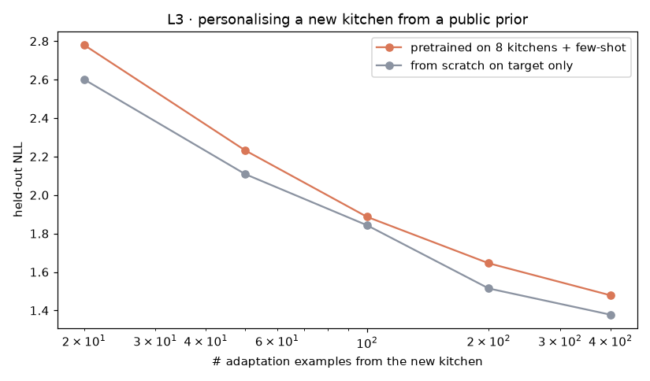
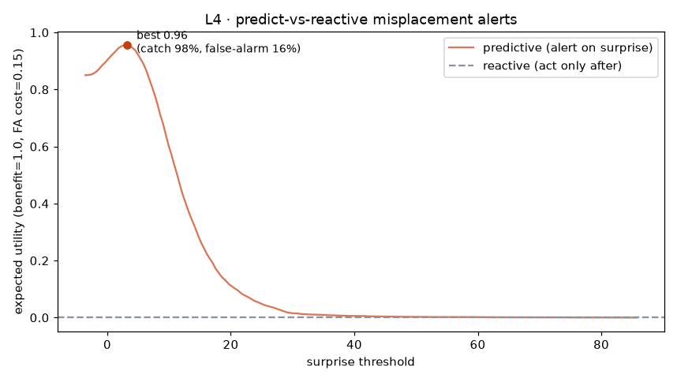
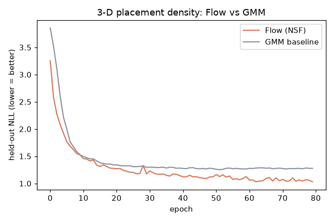

# HD-EPIC-NF — 実厨房の配置を条件付き Normalizing Flow で（実験B＋深化 L1–L4）

実キッチンで**物がどこで扱われるか**の3D位置を Normalizing Flow で `log p(3D位置 | 厨房)` として学習し、**SURPRISE = −log p** を「置き忘れそう」の指標にする。さらに、単なる**異常検知**から一段深めて、**個人の routine のモデル**とその**介入への有用性**まで踏み込む（L1–L4）。図・数値は `python -m hde.report` で自動生成。各図に**観察**と**解釈（だから何が言えるか）**を併記。

## 元データの中身（何が入っているか）

<b>生データ</b>＝HD-EPIC の<b>公開注釈JSON</b>（動画は不使用・ログイン不要）。使ったのは主に <code>eye-gaze-priming / object-movements</code>：物が扱われるたびに <code>{ 3D位置(x,y,z), 視線のズレ(gaze_offset), カメラからの距離(dist_to_cam), 見てから触るまでの時間(prime_gap), 厨房ID(P01…), 移動の開始/終了(phase) }</code>。<br><b>1レコードの実例</b>：<code>P01</code> の台所で、ある物の操作開始点が <code>(-0.11, -3.13, -0.03)</code>、その時 gaze は物から <code>0.07</code> ずれ、カメラから <code>2.3m</code>、見てから触るまで <code>3.5秒</code>。<br>→ 学習の主対象は <b>物の3D位置 × 厨房(≒人)</b>（視線ズレは『見ずに置いたか』の解釈に使用）。計 35,911 レコード。

## 何をしたか（層構造）

- **B（基盤）** `p(位置｜厨房)`：実厨房は多峰なので Flow が GMM に勝つ（Aの『ガウスに並ばれた』反省の実データでの克服）。
- **L1 個人 vs 集団**：“誰か”を知ると予測がどれだけ良くなるか＝習慣は個人的か。
- **L2 ドリフト**：早期に学んだ習慣は後日も当たるか＝“普通”は定常か。
- **L3 few-shot 転移**：新しい人を公共の事前分布から何例で個人化できるか。
- **L4 予測 vs リアクティブ**：サプライズで“事前に”警告する意思決定価値。

## 主要数値

- 基盤：held-out NLL **Flow 1.030 < GMM 1.253**。
- L1 個人化ゲイン **+2.05 nats**（個人条件付けでNLL低下）。
- L2 時間ドリフト **+0.27 nats**（未来日 − ランダム保留）。
- L4 予測ポリシー効用 **+0.95** vs リアクティブ 0（捕捉 98% / 誤警報 16%）。

## データ / 学習

| 項目 | 内容 |
|---|---|
| **データ** | <b>HD-EPIC</b> の公開注釈（実キッチンのエゴセントリック記録・9厨房・複数日）。動画は使わず<b>注釈のみ</b>（物体の3D位置・object movements・視線）を使用。 |
| **使う量** | 「実際に扱われた物」の <b>3D位置 (x,y,z)</b> を厨房ごとに集める（厨房 ≒ その人の台所）。 |
| **予測対象 x** | 物が扱われた <b>3D位置 (x, y, z)</b> |
| **条件 c** | <b>厨房（≒その人）</b> |
| **モデル** | 条件付き <b>Neural Spline Flow</b>（zuko）で <code>p(x,y,z｜厨房)</code>。比較ベース＝GMM。 |
| **スコア** | <b>SURPRISE = −log p</b>＝「その厨房で、その場所にその物があるのはどれだけ意外か」 |

**数字の読み方**

- **NLL（held-out）**：実際の配置をどれだけ当てたか。<b>低いほど良い</b>（負でもOK）。差が大きいほど当てやすい。
- **AUROC**：異常と正常を見分ける力。<b>0.5＝勘・1.0＝完璧</b>。
- **nats（ゲイン）**：条件（誰か・時間）を足したときのNLL改善量。大きいほどその条件が効く。

## 図と解釈

### リプレイ：実厨房の配置密度の上で物を滑らせ、サプライズをライブ計測



**観察**：物を厨房の各位置に置いたときの −log p を色で、白点＝実際の操作位置。プローブが普段の作業島（明）から外れると計器が跳ねる。

**だから何が言えるか**：実厨房でも『普段の置き場』は複数の島＝多峰で存在し、そこを外れた瞬間だけ驚く。＝サプライズは“場所の妥当性”を連続量として測れており、単なる外れ値フラグでなく『どれくらい変か』の勾配を持つ。

### Flow vs GMM：密度の当てはまり と ランダム配置の検出



**観察**：held-out NLL は Flow 1.030 < GMM 1.253（差 0.22 nats）。ランダム配置の検出AUROCは両者とも ~0.9825。

**だから何が言えるか**：厨房配置は多峰なので、単一ガウスの重ね合わせ（GMM）より Flow の方が 0.22 nats ぶん“ありえる場所”を正しく狭く当てている。＝『実験Aでガウスに並ばれた』のは題材が単峰で低次元だったからで、実データの多峰性ではNFの表現力が本質的に効く、という反省の実証。一方ランダム配置は簡単すぎて両者高く、差は密度(NLL)側にしか出ない＝評価は“難しい異常”で見るべき。

### 厨房ごとのサプライズ地図（多峰性）



**観察**：6厨房それぞれ、明るい山（低サプライズ＝定位置）が複数。白点の実操作もその島に乗る。

**だから何が言えるか**：人は物を1箇所でなく数箇所の“定位置”に置く。この多峰構造こそFlowがGMMに勝つ理由で、『どこがその人にとって普通か』は本質的に多峰＝個人ごとに違う地図になる、という次(L1)への布石。

### L1 · 個人 vs 集団：誰かを知ると配置予測はどれだけ良くなるか



**観察**：厨房（＝人）で条件づけたモデルは、集団一律モデルより held-out NLL が平均 2.05 nats 低い。

**だから何が言えるか**：＋なら“誰か”を知るだけで予測が 2.05 nats 改善＝**置き場の習慣は個人ごとに違う**。つまり集団基準の忘れ物検出は、その人には普通の場所を『異常』と誤警報する。個人化は任意でなく必須、という結論。

### L2 · ルーチンのドリフト：早期に学んだ習慣は後日も当たるか



**観察**：早期データで学んだモデルを『後日（未来）』で評価すると NLL が時間無関係のランダム保留より平均 +0.27 nats 変化。

**だから何が言えるか**：未来ほど当てにくい＝“普通”は時間で動く（非定常）。＝静的な忘れ物検出は時間とともに陳腐化し、オンライン更新が要る。習慣が再編される＝これ自体が“忘却/学習”の時間的側面。

### L3 · few-shot 転移：新しい人を“他人の事前分布”から個人化できるか



**観察**：対象厨房に k 例だけで適応。少数(20例)では pretrained 2.78 / scratch 2.60、多め(400例)でも 1.48 / 1.38。

**だから何が言えるか（正直な逆結果）**：他人で事前学習した方が全域で**むしろ悪い**（20例で +0.18 nats）。L1 が示した通り配置習慣は**強く個人的**で、しかも厨房ごとに座標系・レイアウトが違うため、他人の事前分布は“間違った prior”になる。＝**moat は「他人で事前学習」ではなく、本人自身の少数データからの個人化**（またはレイアウトを揃えた表現）にある、という重要な知見。naiveな転移は効かず、個人化の“正しいやり方”選択が本質。

### L4 · 予測 vs リアクティブ：サプライズで“事前に”警告する価値



**観察**：サプライズ閾値を動かした予測ポリシーの期待効用は最大 0.95（リアクティブ＝事後対応は 0）。最良点で at-risk の 98% を捕捉、誤警報 16%。

**だから何が言えるか**：効用が正＝誤警報コストを引いても“置く前に驚いて警告する”方が事後対応より得（正味 0.95）。＝サプライズは検出器の AUC でなく**意思決定に効く**信号で、最適閾値が『いつ介入すべきか』を与える。貢献は“異常検知”でなく**介入ポリシー**、というテーゼの実証。（ただし at-risk はランダムテレポート＝易しめの合成異常なので捕捉率は楽観的。要点は“予測＞リアクティブ”という意思決定の向き。）

### 学習曲線：Flow vs GMM（held-out NLL）



**観察**：エポックごとの検証NLLで Flow が一貫して GMM より低い。

**だから何が言えるか**：表現力の差は初期の運や過学習でなく安定した性質＝多峰配置に対するNFの優位は再現的。

## 再現手順

```bash
python -m hde.fetch
python -m hde.extract
python -m hde.features
python -m hde.train      # 基盤: NSF + GMM
python -m hde.evaluate
python -m hde.heatmap
python -m hde.replay
python -m hde.deep       # L1–L4（個人化 / ドリフト / few-shot / ポリシー）
python -m hde.report     # 図 + 日本語README + index.html（観察＋解釈つき）
```

## 考察：どんなフォーマットのデータがあれば何ができるか

<p>本実装は「<b>3D位置＋厨房ID</b>」が主。データの列がこう増えると、こんな学習に広がる：</p><ul><li><b>＋視線・手ポーズの<u>時系列</u></b>（本データに gaze はあり、系列条件化が次段）→ 『よそ見して置く→後で探す』の因果に踏み込める。</li><li><b>＋その物に次に触れた時刻（放置時間）</b> → 忘却の<b>実ラベル</b>ができ、『低尤度な置き方＝実際に忘れやすい』を直接検証できる（本課題の核心・未達）。</li><li><b>＋物体カテゴリの明示的条件化</b> → 物ごとの置き場マップ（鍋はコンロ・包丁はまな板脇…）。</li><li><b>＋複数日・時刻</b> → 習慣のドリフト（L2で部分実証済み）。</li><li><b>＋レイアウトを揃えた座標系</b> → 他人の事前分布が効き few-shot 転移が可能に（L3で『他人で事前学習が逆効果』だった処方箋）。</li></ul>

_条件付きNFで forget/mistake を測るシリーズの B を、異常検知から**個人化された予測誤差の時間発展＋介入ポリシー**へ深化した版。_